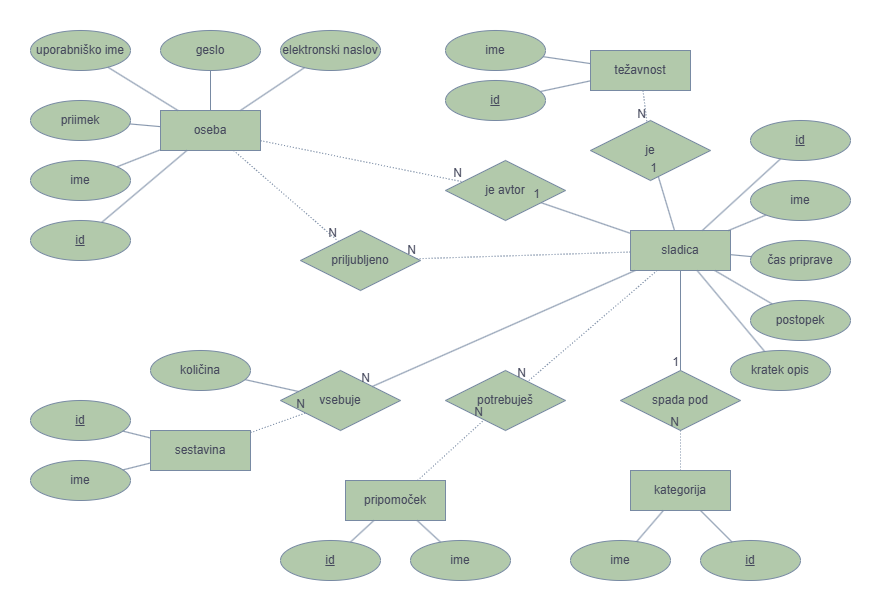

# Baza receptov - OPB projekt
V projektni nalogi pri predmetu Osnove podatkovnih baz bova ustvarili spletno aplikacijo za gledanje in dodajanje receptov za sladice.

## ER diagram

Avtorji: Ana Barba, Eva Gašparič
