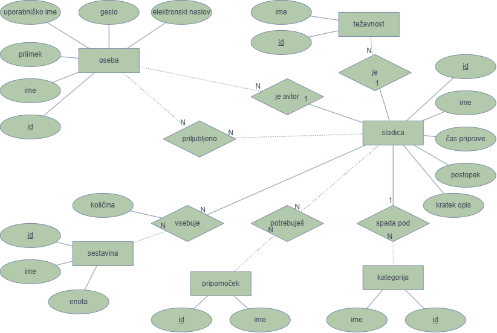

# Baza receptov - OPB projekt

**Avtorji:** Ana Barba, Eva Gašparič

V projektni nalogi pri predmetu **Osnove podatkovnih baz** na FMF sva ustvarili spletno aplikacijo za gledanje in dodajanje receptov za sladice.

Uporabniki lahko pregledujejo recepte, jih iščejo in filtrirajo ter si ogledajo sestavine, pripomočke in postopek priprave posamezne sladice. Registrirani uporabniki lahko dodajajo svoje recepte ter označujejo recepte kot priljubljene.

Knjižnjice, potrebne za nemoteno delovanje aplikacije, so napisane v `requirements.txt`.

## Aplikacija omogoča:
- pregled vseh receptov
- ogled posameznega recepta
- iskanje receptov
- filtriranje receptov po kategorijah
- registracijo uporabnika
- prijavo in odjavo uporabnika
- dodajanje novih receptov za prijavljene uporabnike
- dodajanje, odstranjevanje in pregled priljubljenih receptov za prijavljene uporabnike
- pregled receptov, ki jih je dodal prijavljeni uporabnik
- izbris recepta (to možnost imajo le admini)

## Struktura spletne aplikacije

### Podatkovni nivo - `data/`

Podatkovni nivo skrbi za strukturo podatkovne baze, začetne podatke, pravice dostopa ter komunikacijo aplikacije z bazo.

Sestavljen je iz:
- `create_database.sql` – ustvari strukturo podatkovne baze in vse potrebne tabele ter povezave med njimi; struktura baze sledi ER-diagramu, ki je prikazan spodaj
- `populate_database.sql` – napolni podatkovno bazo z začetnimi podatki, ki sva jih uporabili za testiranje delovanja aplikacije
- `permissions_database.sql` – določa pravice za dostop do podatkovne baze; ločuje pravice lastnikov baze in pravice uporabnikov aplikacije (`javnost`), ki ima samo pravice, ki jih potrebuje za uporabo aplikacije
- `models.py` – vsebuje podatkovne razrede, ki predstavljajo posamezne entitete oziroma obliko podatkov v aplikaciji
- `repository.py` – predstavlja vmesnik med aplikacijo in podatkovno bazo, izvaja SQL-poizvedbe ter rezultate pretvarja v podatkovne razrede

#### ER diagram

ER-diagram prikazuje entitete podatkovne baze, njihove atribute ter povezave med njimi. Na njegovi podlagi so definirane tabele v datoteki `create_database.sql`.



### Aplikacijski nivo - `services/`

Tukaj se nahajajo storitve, ki izvajajo logiko aplikacije. `sladice_service.py` obravnava operacije povezane z recepti, sestavinami, pripomočki; medtem `uporabniki_service.py` obravnava operacije povezane z uporabniki, kot sta prijava in registracija.

### Predstavitveni nivo - `presentation/` in `app.py`

`app.py` sodi v predstavitveni nivo, čeprav je zaradi zagona in organizacije projekta v korenski mapi. V njem so definirane spletne poti (`@get`, `@post`), sprejemajo se podatki iz obrazcev, kličejo ustrezne funkcije iz `services/` in izbirajo HTML-predloge, ki se prikažejo uporabniku.

Poleg tega v predstavitveni nivo sodijo še:
- `views/` - vsebuje HTML-predloge, ki določajo vsebino in strukturo posameznih spletnih strani
- `static/` - vsebuje CSS, ki skrbi za izgled aplikacije
- `bottleext.py` - vsebuje pomožne funkcije za delo z ogrodjem Bottle


## Zagon spletne aplikacije

Za zagon potrebujete **Python 3.10 ali novejši** in **Git**.

**1. Prenesite projekt**

```bash
git clone https://github.com/gaseva/baza-receptov---OPB-projekt.git
cd baza-receptov---OPB-projekt
```

**2. Ustvarite virtualno okolje**

```bash
python -m venv env
```

Aktivirajte ga:

- Windows
```bash
env\Scripts\activate
```

- macOS/Linux
```bash
source env/bin/activate
```

**3. Namestite knjižnice**

```bash
pip install -r requirements.txt
```

**4. Zaženite aplikacijo**

```bash
python app.py
```

Aplikacija je dostopna na [http://localhost:8080](http://localhost:8080).

Za ustavitev aplikacije v terminalu pritisnite `Ctrl + C`.

